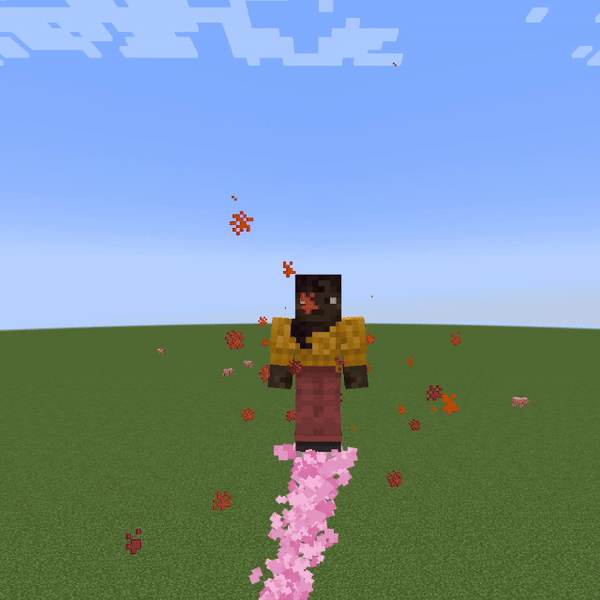

# Player Particles

Player Particles is a simple and easy mod to display particles around yourself in Minecraft. It supports various particles
and command permissions.

## License

This mod is licensed under GNU LGPLv3.

## Donating

If you like this mod, consider [donating](https://buymeacoffee.com/eclipseisoffline).

## Discord

For support and/or any questions you may have, feel free to join [my discord](https://discord.gg/CNNkyWRkqm).

## Version support

| Minecraft Version | Status       |
|-------------------|--------------|
| 26.2.x            | ✅ Current    |
| 26.1.x            | ✔️ Available |
| 1.21.11           | ✔️ Available |
| 1.21.9+10         | ✔️ Available |
| 1.21.6+7+8        | ✔️ Available |
| 1.21.5            | ✔️ Available |
| 1.21.4            | ✔️ Available |
| 1.21.2+3          | ✔️ Available |
| 1.21+1            | ✔️ Available |
| 1.20.5+6          | ✔️ Available |
| 1.20.4            | ✔️ Available |

I try to keep support up for the latest drop of Minecraft. Updates to newer Minecraft
versions may be delayed from time to time, as I do not always have the time to immediately update my mods.

Unsupported versions are still available to download, but they won't receive new features or bugfixes.

NeoForge ports are available for Minecraft 26.1 onwards.

## Usage

Mod builds can be found on the releases page, as well as on [Modrinth](https://modrinth.com/mod/player-particles).

The Fabric API is required on Fabric. The mod can be installed on servers without having to be installed on clients.

The mod works with so-called "particle slots", which you can configure with particles.
It adds a simple command, `/playerparticles`, which can be used to configure your particles:

- `/playerparticles off` - turns your particles off.
- `/playerparticles on` - turns your particles on.
- `/playerparticles reset` - resets your particles in all slots.
- `/playerparticles <slot> <particle|reset> <particle data>` - sets a particle in one of your slots, or resets it.
  - `<particle data>` is only necessary for a some particles.
- `/playerparticles disable-all` - disables rendering all (yours and others) player particles for you. Useful when player particles are laggy for you.
- `/playerparticles enable-all` - enables rendering all (yours and others) player particles for you.
- `/playerparticles interval <interval>` - configures the rate at which player particles appear. Use higher values to slow down the rate.
  - By default, the interval is specified in ticks, append `s` to specify in seconds, e.g. `5s` for 5 seconds.

At the moment, 3 particle slots are available:

- `above` - displays above you.
- `around` - displays around you.
- `below` - displays below you.

### Permissions

The `/playerparticles` command requires the `playerparticles.command` permission, or operator level 2.

Since version 0.2.6, each slot requires the `playerparticles.<slot name>` permission (or operator level 2) to be modified.

### Available particles

These particles are available at the moment:

| Particle name       | Particle description                                                                                                             | `above` slot | `around` slot | `below` slot |
|---------------------|----------------------------------------------------------------------------------------------------------------------------------|--------------|---------------|--------------|
| `note`              | Displays jukebox/note particles                                                                                                  | ✔️           | ✔️            | ❌️           |
| `cherry`            | Displays cherry blossom leaves                                                                                                   | ❌️           | ❌️            | ✔️           |
| `soul`              | Displays soul sand soul particles                                                                                                | ❌️           | ✔️            | ✔️           |
| `sculk_soul`        | Displays sculk soul particles                                                                                                    | ❌️           | ✔️            | ✔️           |
| `end`               | Displays portal particles                                                                                                        | ❌️           | ✔️            | ❌️           |
| `nectar`            | Displays nectar particles                                                                                                        | ❌️           | ✔️            | ✔️           |
| `cloud`             | Displays a white cloud particle                                                                                                  | ✔️           | ✔️            | ✔️           |
| `end_rod`           | Displays end rod particles                                                                                                       | ✔️           | ✔️            | ✔️           |
| `composter`         | Displays the green bonemeal/composter particles                                                                                  | ❌️           | ✔️            | ❌️           |
| `glow`              | Displays glow squid particles                                                                                                    | ❌️           | ✔️            | ❌️           |
| `electric_spark`    | Displays the electric spark from lightning rods                                                                                  | ❌️           | ✔️            | ❌️           |
| `heart`             | Displays heart particles                                                                                                         | ✔️           | ✔️            | ❌️           |
| `dolphin`           | Displays the dolphin trail particle                                                                                              | ❌️           | ✔️            | ✔️           |
| `spore_blossom`     | Displays the spore blossom particles                                                                                             | ❌️           | ✔️            | ❌️           |
| `crimson`           | Displays the crimson forest ambient particles                                                                                    | ❌️           | ✔️            | ❌️           |
| `warped`            | Displays the warped forest ambient particles                                                                                     | ❌️           | ✔️            | ❌️           |
| `ash`               | Displays the soul sand valley ambient particles                                                                                  | ❌️           | ✔️            | ❌️           |
| `enchant`           | Displays the enchanting table glyph particles                                                                                    | ❌️           | ✔️            | ❌️           |
| `infested`          | Displays the particles produced by the infested effect                                                                           | ✔️           | ✔️            | ❌️           |
| `small_gust`        | Displays the particles produced by the wind charged effect                                                                       | ✔️           | ✔️            | ❌️           |
| `red_omen`          | Displays the raid omen particles                                                                                                 | ❌️           | ✔️            | ❌️           |
| `blue_omen`         | Displays the trial omen particles                                                                                                | ❌️           | ✔️            | ❌️           |
| `ominous_spawning`  | Displays the ominous spawner particles                                                                                           | ❌️           | ✔️            | ❌️           |
| `red_bar`           | Displays the trial spawner detection particles                                                                                   | ✔️           | ✔️            | ❌️           |
| `blue_bar`          | Displays the ominous spawner detection particles                                                                                 | ✔️           | ✔️            | ❌️           |
| `dripping_honey`    | Displays dripping honey particles                                                                                                | ❌️           | ❌️            | ✔️           |
| `dripping_lava`     | Displays dripping lava particles                                                                                                 | ❌️           | ❌️            | ✔️           |
| `dripping_obsidian` | Displays dripping crying obsidian particles                                                                                      | ❌️           | ❌️            | ✔️           |
| `dripping_water`    | Displays dripping water particles                                                                                                | ❌️           | ❌️            | ✔️           |
| `firework`          | Displays firework launch particles                                                                                               | ❌️           | ✔️            | ✔️           |
| `flame`             | Displays torch flame particles                                                                                                   | ✔️           | ✔️            | ❌️           |
| `soul_fire_flame`   | Displays soul torch flame particles                                                                                              | ✔️           | ✔️            | ❌️           |
| `copper_fire_flame` | Displays copper torch flame particles                                                                                            | ✔️           | ✔️            | ❌️           |
| `lava`              | Displays "lava pop" particles                                                                                                    | ✔️           | ✔️            | ❌️           |
| `scrape`            | Displays the copper scrape particles                                                                                             | ❌️           | ✔️            | ❌️           |
| `sculk_charge`      | Displays sculk charge particles                                                                                                  | ❌️           | ❌️            | ✔️           |
| `totem`             | Displays totem of undying particles                                                                                              | ❌️           | ❌️            | ✔️           |
| `shriek`            | Displays sculk shrieker activation particles                                                                                     | ✔️           | ❌️            | ❌️           |
| `wax_off`           | Displays wax off particles                                                                                                       | ❌️           | ✔️            | ❌️           |
| `wax_on`            | Displays wax on particles                                                                                                        | ❌️           | ✔️            | ❌️           |
| `firefly`           | Displays fire flies                                                                                                              | ❌️           | ✔️            | ❌️           |
| `pause_mob_growth`  | Displays green particles (the ones that display when you age lock a baby mob)                                                    | ❌️           | ✔️            | ❌️           |
| `reset_mob_growth`  | Displays green particles (the ones that display when you age unlock a baby mob)                                                  | ❌️           | ✔️            | ❌️           |
| `sulfur_cube_goo`   | Displays sulfur cube goo particles                                                                                               | ❌️           | ❌️            | ✔️           |
| `noxious_gas`       | Displays noxious gas (yellow clouds)                                                                                             | ❌️           | ✔️            | ✔️           |
| `geyser_poof`       | Displays geyser poofs (white clouds)                                                                                             | ❌️           | ✔️            | ✔️           |
| `geyser_plume`      | Displays geysers                                                                                                                 | ✔️           | ❌️            | ❌️           |
| `pale_oak_leaves`   | Displays pale oak leaves                                                                                                         | ❌️           | ✔️            | ✔️           |
| `sonic_boom`        | Displays sonic boom particles                                                                                                    | ❌️           | ✔️            | ❌️           |
| `color`             | Displays coloured dust particles around you. You can specify an ordered list of (hex) colours to display in the particle data.   | ✔️           | ✔️            | ✔️           |
| `potion`            | Displays coloured potion particles around you. You can specify an ordered list of (hex) colours to display in the particle data. | ❌️           | ✔️            | ❌️️          |
| `tinted_leaves`     | Displays coloured falling leaves around you. You can specify an ordered list of (hex) colours to display in the particle data.   | ❌️           | ❌️️           | ✔️           |
| `flag`              | Displays a pride flag in dust particles around you. You can specify the flag to display in the particle data.                    | ✔️           | ✔️            | ️✔️          |
| `flag_potion`       | Displays a pride flag in potion particles around you. You can specify the flag to display in the particle data.                  | ❌️           | ✔️            | ️❌️          |
| `item`              | Displays an item particle around you. You can specify the item to display particles of in the particle data.                     | ❌️           | ✔️            | ✔️           |

I try to regularly add new particle options whenever Minecraft does.

### Available flags for the pride flag particles

- `pride`
- `trans`
- `gay`
- `lesbian`
- `bi`
- `pan`
- `poly`
- `asexual`
- `aromantic`
- `queerplatonic`
- `non_binary`
- `genderfluid`
- `genderqueer`
- `librafeminine`
- `libramasculine`
- `agender`
- `demiboy`
- `demigirl`
- `aroace`
- `voidpunk`
- `transfeminine`
- `transmasculine`

You're free to suggest more flags by opening an issue report.
